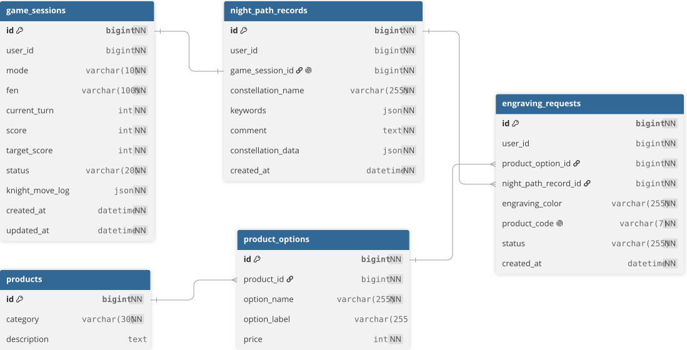

<div align="center">

# ♞ 나이트의 길 (Night Challenge) 🌌


### "나이트의 움직임이, 나만의 밤하늘이 된다."

Knight의 움직임을 Night의 별자리로 연결하는 AI 기반 개인화 각인 서비스

> "나이트"는 체스 기물 **Knight**(기사)와 밤하늘 **Night**을 동시에 뜻하는 중의적 표현입니다.


**[🌐 서비스 바로가기](https://night-frontend-rho.vercel.app/)**

</div>

<br>

<div align="center">

2026년 '붉은 말의 해'에서 말의 이미지를 체스의 나이트(Knight)로 확장하고,<br>
체스판 위에 남겨진 나이트의 이동 궤적을 밤하늘의 별자리 디자인으로 재해석했습니다.

<br>

기존 제품 각인은 사용자가 준비된 디자인을 선택하거나 직접 디자인해야 했습니다.<br>
나이트의 길은 사용자가 디자인을 고민하는 대신,<br>
<b>플레이 과정 자체가 하나뿐인 제품 각인</b>이 되도록 합니다.

</div>

<br>

## 📑 목차

- [팀원](#-팀원)
- [기술 스택](#-기술-스택)
- [AI 활용 방식](#-ai-활용-방식)
- [주요 기능](#-주요-기능)
- [서비스 흐름](#-서비스-흐름)
- [ERD](#-erd)
- [주요 API](#-주요-api)
- [API 공통 응답 형식](#-api-공통-응답-형식)
- [프로젝트 구조](#-프로젝트-구조)
- [로컬 실행 방법](#-로컬-실행-방법)
- [테스트](#-테스트)
- [배포](#-배포)
- [브랜치 전략](#-브랜치-전략)
- [보안](#-보안)

---

## 👥 팀원

<table width="100%">
  <tr align="center">
    <th width="20%">신지윤</th>
    <th width="20%">김민주</th>
    <th width="20%">현정요</th>
    <th width="20%">김의지</th>
    <th width="20%">장가윤</th>
  </tr>
  <tr align="center">
    <td></td>
    <td></td>
    <td></td>
    <td></td>
    <td></td>
  </tr>
  <tr align="center">
    <td><a href="https://github.com/shinjiyun-ux">@shinjiyun-ux</a></td>
    <td><a href="https://github.com/llszos">@llszos</a></td>
    <td><a href="https://github.com/iamnotjungyo">@iamnotjungyo</a></td>
    <td><a href="https://github.com/kimuiji">@kimuiji</a></td>
    <td><a href="https://github.com/vynziie">@vynziie</a></td>
  </tr>
  <tr align="center">
    <td><code>PM/Design</code></td>
    <td><code>BE</code></td>
    <td><code>BE</code></td>
    <td><code>FE</code></td>
    <td><code>FE</code></td>
  </tr>
  <tr valign="top">
    <td>
      <b>[ 서비스 기획 ]</b><br>
      MCM 브랜드 특성·기회 요인 분석<br>
      유사 사례 및 경쟁 서비스 분석<br>
      서비스 방향 및 차별화 포인트 구체화<br>
      페르소나와 사용자 흐름 구체화<br>
      IA 및 기능명세서 구체화<br><br>
      <b>[ UX/UI 디자인 ]</b><br>
      게임·각인·제품·마이페이지 화면 설계<br>
      와이어프레임 및 프로토타입 제작<br>
      피그마 디자인 및 화면별 UI 관리<br><br>
      <b>[ 비즈니스 전략 ]</b><br>
      SWOT 및 경쟁시장 포지셔닝 분석<br>
      비즈니스 모델과 수익 구조 설계<br>
      마케팅 플랜 및 비즈니스 로드맵 수립<br>
      서비스 확장 방향 기획<br><br>
      <b>[ 발표 ]</b><br>
      발표 스토리 구성 및 자료 디자인
    </td>
    <td>
      <b>[ 보유 각인 ]</b><br>
      게임 각인 데이터 연동<br>
      보유 각인 목록/상세 조회<br>
      각인 이름 수정<br>
      원본 이동 궤적 응답 구성<br>
      최종 별자리 데이터 응답 구성<br><br>
      <b>[ 제품 및 각인 신청 ]</b><br>
      카테고리별 제품 목록/옵션 상세 조회<br>
      각인 신청(제품·보유 각인·색상 조합)<br>
      신청 상태별 목록 조회 및 취소<br>
      제품 코드 자동 생성<br>
      각인 색상 응답 연동<br><br>
      <b>[ 마이페이지 ]</b><br>
      사용자 정보 조회<br>
      제품 각인 신청 여부 조회<br>
      최근 생성 카드 조회<br>
      보유 각인 카드 모음/상세 조회<br><br>
      <b>[ 배포·연동 및 협업 ]</b><br>
      기능별 진행 상황 확인 및 일정 조율<br>
      Railway 백엔드·MySQL 환경 구성 및 배포<br>
      프론트엔드 API 연동 및 오류 보완<br>
      API 명세서·ERD·데이터 구조 문서 관리
    </td>
    <td>
      <b>[ 게임 세션 관리 ]</b><br>
      게임 세션 생성 및 이어하기<br>
      난이도별 목표 점수와 턴 관리<br>
      게임 상태 및 나이트 이동 궤적 저장<br><br>
      <b>[ 체스 엔진 및 AI 상대 ]</b><br>
      합법 이동 조회 및 이동 처리<br>
      체스 규칙 및 AI 상대 로직 구현<br>
      사용자 이동 후 AI 응수 처리<br>
      점수·승패 판정과 게임 통계 조회<br><br>
      <b>[ 궤적 처리 ]</b><br>
      사용자 나이트별 이동 궤적 분리<br>
      나이트 궤적의 별자리 변환·재생성 로직 구현<br>
      동일 게임의 각인 중복 생성 방지<br><br>
      <b>[ AI 각인 생성 ]</b><br>
      플레이 성향 AI 분석 연동<br>
      각인 이름·키워드·코멘트 생성
    </td>
    <td>
      <b>[ 공통 UI ]</b><br>
      폰 목업 프레임 구현<br>
      상단 내비게이션 및 하단 탭바 구현<br>
      공통 로딩 화면 구현<br><br>
      <b>[ 각인 탭 ]</b><br>
      각인 생성·이름 설정 화면 구현<br>
      Before/After 별자리 렌더링<br>
      생성된 각인 카드 획득 흐름 구현<br>
      보유 각인 목록 및 상세 화면 구현<br>
      각인 이름 수정·재생성 흐름 구현<br>
      각인 API 연동 및 상태별 UI 처리<br><br>
      <b>[ 마이페이지 탭 및 카드 ]</b><br>
      마이페이지 메인·최근 카드 구현<br>
      카드 모음 및 신청 내역 조회 구현<br>
      카드 공유 및 완료 안내 UI 구현<br>
      제품 각인 신청 취소 흐름 구현<br>
      마이페이지 API 연동 및 상태별 UI 처리<br><br>
      <b>[ 배포 ]</b><br>
      Vercel 환경 구성 및 배포
    </td>
    <td>
      <b>[ 게임 탭 ]</b><br>
      홈·게임 배너 및 이미지 슬라이드 구현<br>
      게임 시작 및 이어하기 화면 구현<br>
      체스판과 이동 가능 칸 렌더링<br>
      게임 진행·점수·턴 화면 구현<br>
      게임 재진입·새로고침 상태 복원<br>
      게임 결과와 각인 생성 흐름 연동<br>
      게임 API 연동 및 오류 보완<br><br>
      <b>[ 제품 탭 ]</b><br>
      제품 목록 및 옵션 상세 화면 구현<br>
      제품 옵션별 이미지 매핑<br>
      제품 모달·팝업 인터랙션 구현<br>
      제품 조회 API 연동 및 오류 보완<br><br>
      <b>[ 각인 신청 ]</b><br>
      보유 각인 선택과 제품 미리보기 구현<br>
      각인 색상 선택 및 신청 흐름 구현<br>
      각인 신청 API 연동 및 오류 보완
    </td>
  </tr>
</table>

---

## 🧰 기술 스택

<table>
  <tr>
    <th align="center">Frontend</th>
    <th align="center">Backend</th>
    <th align="center">Design</th>
    <th align="center">Collaboration</th>
  </tr>
  <tr>
    <td valign="top">
      <br />
      <br />
      <br />
      <br />
      <br />
      <br />
    </td>
    <td valign="top">
      <br />
      <br />
      <br />
      <br />
      <br />
      <br />
    </td>
    <td valign="top">
      <br />
    </td>
    <td valign="top">
      <br />
      <br />
      <br />
      <br />
    </td>
  </tr>
</table>

---

## 🤖 AI 활용 방식

- 나이트 이동 궤적을 생성 로직으로 재구성해 별자리 좌표 데이터 생성
- AI가 게임 정보와 이동 경로를 분석해 플레이 성향 해석
- 분석 결과를 바탕으로 각인 이름·키워드·코멘트 추천
- Before(원본 이동 궤적)와 After(최종 별자리) 좌표 데이터를 API로 제공

> AI가 별자리 이미지를 직접 생성하는 구조가 아니라, <br>생성 로직이 플레이 궤적을 별자리 좌표로 재구성하고 AI가 해당 디자인에 이름과 이야기를 더하는 방식입니다.

---

## ✨ 주요 기능

**🎮 게임**

- `EASY`, `HARD` 난이도별 게임 세션 생성
- 완료된 게임의 최고 점수와 플레이 횟수 조회
- 가장 최근의 진행 중 게임 조회
- 체스 규칙에 따른 합법 이동 조회
- 사용자 이동과 AI 응수를 한 턴으로 처리
- 점수·턴·승패 상태 및 나이트 이동 궤적 저장
- 목표 점수·턴 수·체크메이트·나이트 전멸에 따른 승패 판정

**🃏 각인**

- 승리한 게임의 이동 궤적으로 별자리 각인 생성
- AI 기반 각인 이름·키워드·코멘트 추천
- 원본 궤적을 유지한 최종 별자리 디자인 재생성
- 동일 게임의 각인 중복 생성 방지
- 보유 각인 목록·상세 조회 및 이름 수정

**🛍️ 제품 및 각인 신청**

- 카테고리별 제품 및 옵션 상세 조회
- 보유 각인과 색상을 선택해 제품 각인 신청
- 신청별 고유 제품 코드 자동 생성
- 신청 상태별 목록 조회
- 제품 각인 신청 취소 처리

**👤 마이페이지**

- 사용자 정보 및 제품 각인 신청 여부 조회
- 가장 최근에 생성한 각인 카드 조회
- 보유 각인 카드 모음 조회
- 제품 각인 신청 내역 조회

---

## 🧭 서비스 흐름

1. 난이도 선택 및 게임 시작
2. 사용자 이동과 AI 응수
3. 게임 결과 및 나이트 이동 궤적 저장
4. 이동 궤적을 별자리 디자인으로 재구성
5. AI 플레이 분석 및 이름·키워드·코멘트 추천
6. 최종 별자리 디자인과 각인 이름 결정
7. 제품·옵션 및 각인 색상 선택
8. 제품 각인 신청
9. 마이페이지에서 신청 내역과 보유 카드 확인

---

## 🗂️ ERD



**주요 관계**

- `GameSession` → `NightPathRecord` : 논리적 일대일
- `NightPathRecord` → `EngravingRequest` : 일대다
- `Product` → `ProductOption` : 일대다
- `ProductOption` → `EngravingRequest` : 일대다

> `GameSession`과 `NightPathRecord`는 논리적 1 : 0..1 관계입니다.
> `game_session_id`는 `NOT NULL`, `UNIQUE`로 관리하지만 실제 JPA 연관관계와 DB 외래 키는 사용하지 않습니다.

---

## 🔌 주요 API

**🎮 게임 및 각인 생성**

| 기능 | Method | URI |
|:---|:---:|:---|
| 게임 시작 | `POST` | `/api/games` |
| 게임 통계 조회 | `GET` | `/api/games/stats` |
| 진행 중 게임 조회 | `GET` | `/api/games/active` |
| 합법 이동 조회 | `GET` | `/api/games/{gameSessionId}/legal-moves` |
| 이동 실행 | `POST` | `/api/games/{gameSessionId}/moves` |
| 게임 상세 조회 | `GET` | `/api/games/{gameSessionId}` |
| 각인 생성 | `POST` | `/api/games/{gameSessionId}/engravings` |

**🃏 보유 각인**

| 기능 | Method | URI |
|:---|:---:|:---|
| 보유 각인 목록 조회 | `GET` | `/api/engravings` |
| 보유 각인 상세 조회 | `GET` | `/api/engravings/{id}` |
| 보유 각인 이름 수정 | `PATCH` | `/api/engravings/{id}` |
| 최종 별자리 재생성 | `PATCH` | `/api/engravings/{id}/regenerate` |

**🛍️ 제품 및 각인 신청**

| 기능 | Method | URI |
|:---|:---:|:---|
| 제품 목록 조회 | `GET` | `/api/products?category={category}` |
| 제품 옵션 상세 조회 | `GET` | `/api/products/options/{optionId}` |
| 제품 각인 신청 | `POST` | `/api/engraving-requests` |
| 제품 각인 신청 목록 조회 | `GET` | `/api/engraving-requests?status={status}` |
| 제품 각인 신청 취소 | `PATCH` | `/api/engraving-requests/{id}/cancel` |

**👤 마이페이지**

| 기능 | Method | URI |
|:---|:---:|:---|
| 마이페이지 메인 조회 | `GET` | `/api/mypage` |
| 각인 카드 모음 조회 | `GET` | `/api/engravings/cards` |

**📄 API 명세서**

프론트엔드 연동에 사용한 전체 API 명세는 아래 문서에서 확인할 수 있습니다.

- [전체 API 명세서](https://like-atlasaurus-184.notion.site/API-2ca098617aed820fb4528171236cb76f?source=copy_link)

---

## 📦 API 공통 응답 형식

모든 API 응답은 `status`, `message`, `data`로 구성된 공통 객체로 반환합니다.

```json
{
  "status": "success",
  "message": null,
  "data": {}
}
```

- **`status`** — 성공 시 `success`, 실패 시 `error`
- **`message`** — 안내 또는 오류 문구. 필요하지 않으면 `null`
- **`data`** — 실제 응답 데이터. 반환할 데이터가 없거나 실패하면 `null`

모든 JSON key는 `camelCase` 형식을 사용합니다.

---

## 📁 프로젝트 구조

```text
src
├── main
│   ├── java/com/nightchallenge/backend
│   │   ├── game
│   │   ├── engraving
│   │   ├── product
│   │   ├── engravingrequest
│   │   ├── mypage
│   │   └── global
│   └── resources
└── test
    └── java/com/nightchallenge/backend
```

---

## 🚀 로컬 실행 방법

**1. 저장소 복제**

```bash
git clone https://github.com/night-challenge/night-backend.git
cd night-backend
```

**2. 환경변수 설정**

| 환경변수 | 설명 |
|:---|:---|
| `SPRING_DATASOURCE_URL` | MySQL JDBC URL |
| `SPRING_DATASOURCE_USERNAME` | MySQL 사용자명 |
| `SPRING_DATASOURCE_PASSWORD` | MySQL 비밀번호 |
| `OPENAI_API_KEY` | OpenAI API 키 |
| `OPENAI_API_MODEL` | 사용할 OpenAI 모델명 |
| `SPRING_PROFILES_ACTIVE` | 실행 프로필 (로컬 `local` / 배포 `prod`) |
| `CORS_ALLOWED_ORIGINS` | 허용할 프론트엔드 Origin |

> 실제 DB 비밀번호와 API 키는 저장소에 포함하지 않습니다.

**3. 애플리케이션 실행**

macOS/Linux
```bash
./gradlew bootRun
```

Windows
```powershell
.\gradlew.bat bootRun
```

기본 실행 주소는 `http://localhost:8080` 입니다.

---

## ✅ 테스트

macOS/Linux
```bash
./gradlew test
```

Windows
```powershell
.\gradlew.bat test
```

---

## ☁️ 배포

- **Backend** — [Railway](https://night-backend-production.up.railway.app)
- **Database** — Railway MySQL
- **Frontend** — [Vercel](https://night-frontend-rho.vercel.app/)

> Railway 무료 Trial 크레딧으로 운영 중입니다. 크레딧 소진 또는 배포 인시던트로 일시적으로 접속이 안 될 수 있으니, <br>문제 발생 시 [로컬 실행 방법](#-로컬-실행-방법)으로 대체 확인 가능합니다.

---

## 🌿 브랜치 전략

- `main` — 최종 배포 및 제출
- `dev` — 기능 통합 및 배포 전 확인
- `feat/*` — 기능 개발
- `fix/*` — 오류 수정
- `chore/*` — 설정 및 배포 작업

---

## 🔒 보안

- 실제 DB 비밀번호와 OpenAI API 키는 GitHub에 저장하지 않습니다.
- 민감한 값은 로컬 환경변수 또는 Railway Variables로 관리합니다.
- 공개 저장소로 전환하기 전 민감한 파일과 커밋 이력을 확인합니다.
